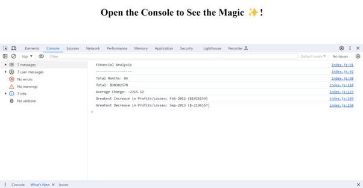

# Console-Finances

## Overview
This challenge involved analysing a financial dataset using JavaScript. The task required creating code to calculate key financial metrics such as the total number of months, net total Profit/Losses, average change, greatest increase, and greatest decrease in profits over a given period.

## User Story
As a financial analyst, I require a tool to analyse a company's financial records efficiently. This tool should calculate key metrics such as the total number of months in the dataset, the net total amount of Profit/Losses, the average changes in Profit/Losses, and identify the dates and amounts of the greatest increase and decrease in Profit/Losses.

I want the analysis results to be clearly printed to the console in an organised format, allowing me to extract essential insights from the financial dataset for informed decision-making in my role as a financial analyst.

## Acceptance Criteria

My Console Finances Analysis will be considered done when the following actions are fulfilled:

* Running the JavaScript code displays the total number of months included in the dataset.
* Running the JavaScript code displays the net total amount of Profit/Losses over the entire period.
* Running the JavaScript code displays the average change in Profit/Losses over the entire period.
* Running the JavaScript code displays the greatest increase in Profit/Losses, including the date and amount.
* Running the JavaScript code displays the greatest decrease in Profit/Losses, including the date and amount.
* The financial analysis output in the console follows a clear and readable format.


## Steps Taken

1. Repository Setup

* Created a new GitHub repository named Console-Finances.
Cloned the repository to the local machine for code development.

2. File Structure

* Examined the provided dataset in the starter/index.js file, which consisted of arrays with Date and Profit/Losses fields.

3. Coding Process

* Developed JavaScript code to perform the following calculations:

    * The total number of months included in the dataset.
    * The net total amount of Profit/Losses over the entire period.
    * The average of the changes in Profit/Losses over the entire period.
    * The greatest increase in Profit/Losses (date and amount) over the entire period.
    * The greatest decrease in Profit/Losses (date and amount) over the entire period.

4. Console Output

* Printed the results of the financial analysis to the console in the specified format.


## Specified Format.

  ```text
  Financial Analysis 
  ----------------
  Total Months: 86
  Total: $38382578
  Average Change: -2315.12
  Greatest Increase in Profits/Losses: Feb-2012 ($1926159)
  Greatest Decrease in Profits/Losses: Sep-2013 ($-2196167)
  ```


## Lessons Learned
* Gained a deeper understanding of JavaScript fundamentals.
* Enhanced problem-solving skills in the context of financial data analysis.
* Explored different approaches to calculating and presenting financial metrics.

## Conclusion

Through this project, I successfully implemented JavaScript code to analyse financial records, providing a clear overview of the company's performance. The console output displays essential metrics, including total months, net profit/losses, average change, and the greatest increase and decrease in profits. This project honed my skills in data analysis and JavaScript programming, contributing to my growing expertise as a developer.


## Webpage Screenshot




## Webpage Link

- A live version of the results can be accessed here: 
[Live Link](https://6595c7dbc648e8040c3dc599--frolicking-capybara-20a22b.netlify.app/)